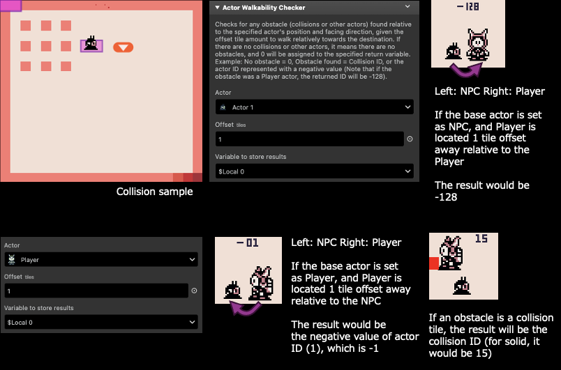

# Actor Walkability Checker

Obtains an obstacle info relative to the actor's facing direction.

:::info
This plugin only supports 8x8 tile size mode.
:::

## Description

Checks for any obstacle (map collisions or other actors) found relative to the specified actor's position and facing direction, given the offset tile amount to walk relatively towards the destination. If there are no map collisions or other actors, it means there are no obstacles, and 0 will be assigned to the specified return variable. Otherwise, this plugin will return the obstacle ID information. Example: No obstacle = 0, Obstacle found = Map Collision ID, or the actor ID represented with a negative value (Note that if the obstacle was a Player actor, the returned ID will be -128). If a map collision ID is found, the actor/player ID will be ignored.

