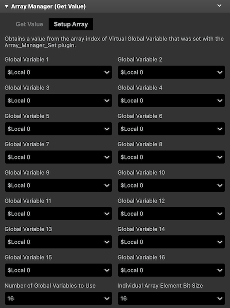
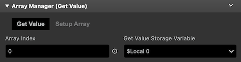
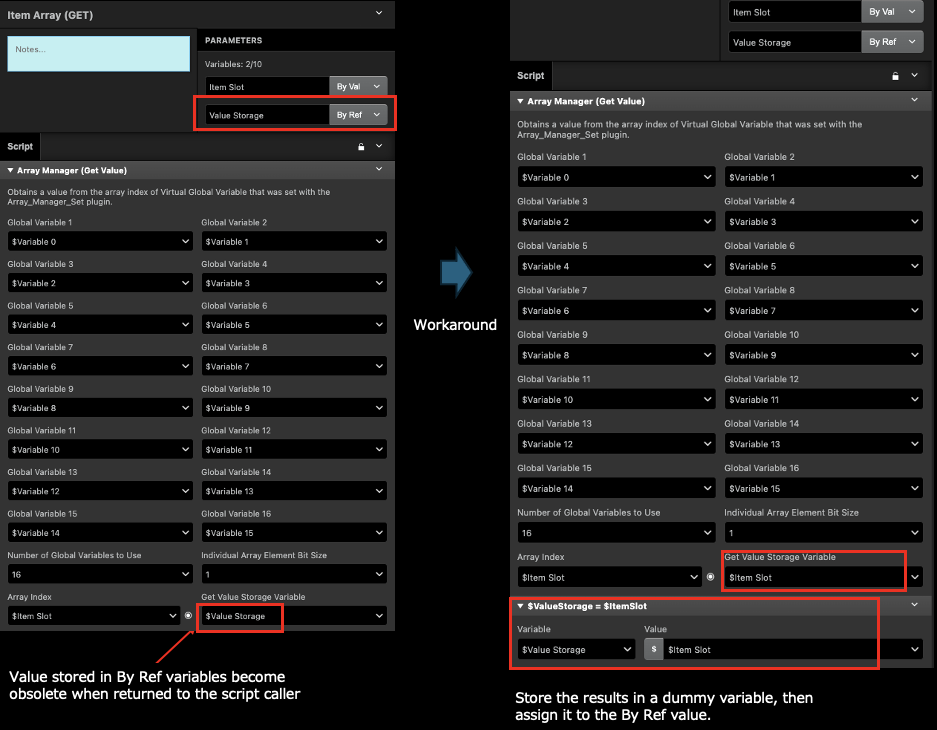

# Array Manager (Get Value)

Obtains a value from the array index of a Virtual Global Variable that was set with the [Array Manager (Set Value)](./array_manager_set.md) plugin.

## Description

See details in [Array Manager (Set Value) Description](./array_manager_set.md#description) for basic info on the Virtual Global Variable concept.

### `Setup Array Tab`

### _Global Variables 1 - 16_

Specify the global variables that you want to merge. This should be same as the global variables set in the [Array Manager (Set Value)](./array_manager_set.md) plugin.

### _Number of Global Variables to Use_

From the global variables set, specify the number of global variables to be merged (counting from top). Typically, you want to set the same value specified in the [Array Manager (Set Value)](./array_manager_set.md) plugin.

### _Individual Array Element Bit Size_

Specify how many bits you like to divide each global variable with. Typically, you want to set the same value specified in the [Array Manager (Set Value)](./array_manager_set.md) plugin.

### `Get Value Tab`

### _Array Index_

Specify the index in the Virtual Global Variable to be manipulated on. For more info, refer to the description of the [Array Manager (Set Value)](./array_manager_set.md#array-index) plugin.

### _Get Value Storage Variable_

The variable to store the obtained value.

:::caution

### (GB Studio v4.0.x) Notes when using the plugins inside custome events.

GBS 4.0.1, 4.0.2 seems to have an issue of storing values into variables that are passed By Ref. When a variable is set as By Ref and assigned a value via a plugin, the value is not actually assigned at all and sets to 0. When you assign a value directly to the referenced variable using only custom event scripts, this issue does not happen. So, the current workaround is to add an extra variable assignment script inside the custom event script before assigning to the By Ref var.

:::