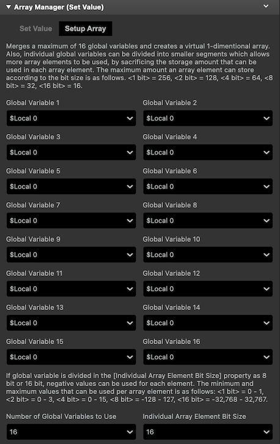
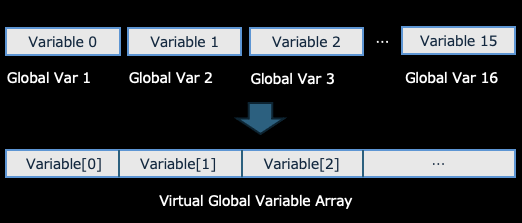
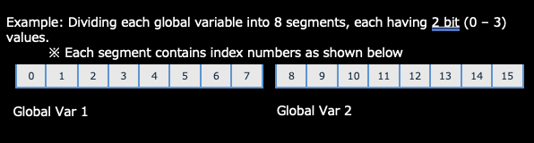
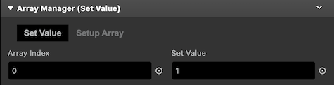

# Array Manager (Set Value)

Merges multiple global variables and use it as a virtual array (SET VALUE). This plugin only sets a value to the virtual array. Use [Array Manager (Get Value)](./array_manager_get.md) plugin to get the value from the virtual array.

## Description

Merges a maximum of 16 global variables and creates a virtual 1-dimentional array.
Also, individual global variables can be divided into smaller segments which allows more array elements to be used, by sacrificing the storage amount that can be used in each array element.
This array division settings can be configured in the [Individual Array Element Bit Size] property. The maximum array size according to the bit size is as follows. &lt;1 bit&gt; = 256, &lt;2 bit&gt; = 128, &lt;4 bit&gt; = 64, &lt;8 bit&gt; = 32, &lt;16 bit&gt; = 16.

### `[Setup Array] Tab`

### _Global Variables 1 - 16_

Specify the global variables that will be merged. Merged global variables are now trated as a single “Virtual Global Variable”. A Virtual Global Variable is assigned with index numbers, so for example if you want to access global variable 3, you can acces it like an array (Note: Index numbers begin with 0).

### _Number of Global Variables to Use_

From the global variables list, specify the number of global variables to be merged (counting from top). In the screenshot example above, if “2” is specified, global variables 1 and 2 will be used and others will be ignored. If the default value 16 is specified, all global variables set will be merged.

### _Individual Array Element Bit Size_

To use more arrays, you can divide individual global variables with the bit size you want. GB Studio’s global variable has 16 bit size each, so you can divide up the bit size in the range of 1, 2, 4, 8, 16. For example, if “2” bit is specified, each global variables will be divided into 8 segments (having 2 bit worth of storage per segment). If “8” bit is specified, each global variables will be divided into 2 segments (having 8 bit each per segment).

If global variable is divided in the [Individual Array Element Bit Size] property as “8” bit or “16” bit, negative values can be used for each element. The minimum and maximum values that can be used per array element is as follows. &lt;1 bit&gt; = 0 - 1, &lt;2 bit&gt; = 0 - 3, &lt;4 bit&gt; = 0 - 15, &lt;8 bit&gt; = -128 - 127, &lt;16 bit&gt; = -32,768 - 32,767.

### `[Set Value] Tab`

### _Array Index_

Specify the index in the Virtual Global Variable to be manipulated on. For example, if you merged 16 global variables divided by 1 bit segment, you can address indexes between 0 and 255.

### _Set Value_

The value (number or variable) to be stored into the specified array index.

#### Size-Value relational example of 16 global variables merged

| Individual Array Element Bit Size | Array Size | Min - Max value |
|:-----------|:------------:|:------------:|
| 1 | 256 |0〜1|
| 2 | 128 |0〜3|
| 4 | 64 |0〜15|
| 8 | 32 |-128〜127|
| 16 | 16 |-32,768〜32,767|
