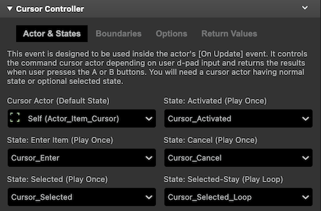
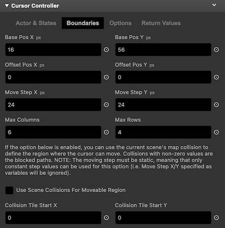
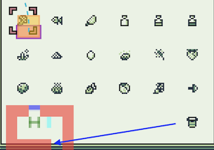
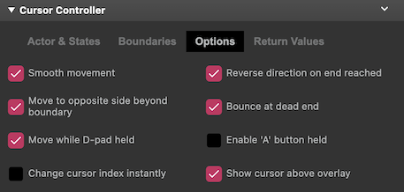
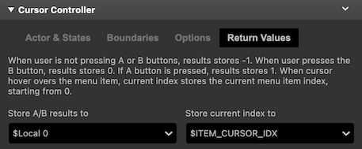
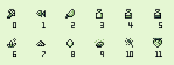

# Cursor Controller

Lets you control a selection cursor sprite with animations in a _"quick and dirty"_ way.

:::info
This plugin only supports 8x8 tile size mode.
:::

## Description

This plugin provides a method for setting up and controlling a selection cursor using an actor with several animation states that change based on cursor actions or movements. It detects user input via the D-pad or buttons and returns the current cursor’s item index according to the user’s actions. This functionality is intended to be used within the actor’s [On Update] event.

Please note, when I refer to “quick and dirty”, it indicates that this plugin may negatively impact game performance depending on how it is used. The underlying logic is somewhat complex due to its increased functional versatility, which means allowing multiple options for tweaking the plugin can significantly slow down your game under certain conditions.

### `[Actor & States] Tab`

The [Actor & States] tab lets you specify the default actor to be used as the selection cursor. You can also set different animation states of the same actor sprite that automatically changes depending on the selected action (move, accept, cancel, etc).

### _Cursor Actor (Default State)_

The selection cursor actor in its default state. This is the looping animation where the actor is in its idle state (when user is not pressing any buttons).

### _State: Activated (Play Once)_

Specify the actor's animation state when the cursor is activated.

### _State: Enter Item (Play Once)_

Specify the actor's animation state to be used when entered into a different item from the current one. In other words, this state is triggered when cursor index changes.

### _State: Cancel (Play Once)_

The selection cursor animation state when user cancels the selection mode. This is triggered when the user presses the B button.

### _State: Selected (Play Once)_

Specify the actor's animation state to be used when the item is selected. This is triggered when the user presses the A button.

### _State: Selected-Stay (Play Loop)_

Specify the actor's animation state to be used when the item is selected, and cursor is staying in its same position. You may want to set this if you have multiple selection cursors (like one for main menu item, and one for sub items) in the same scene where one stays at the selected position to indicate the previously selected category, while the other cursor indicating the current moveable selection item.

### `[Boundaries] Tab`

The [Boundaries] tab defines the boundaries in which the cursor is allowed to move and the distance per movement step.

### _Base Pos X_

Base position-x (far left) of cursor in pixels units. This will be the starting position X on the screen where the cursor will be placed.

### _Base Pos Y_

Base position-y (far top) of cursor in pixels units. This will be the starting position Y on the screen where the cursor will be placed.

### _Offset Pos X_

Normally you want to leave this as "0". If needed, you can add an offset to the cursor’s x-axis in pixel units. A common use case for setting an offset is when there are inconsistent pixel distances (or steps) while moving the cursor to a specific position. You can dynamically adjust the offset during runtime based on the current cursor index to achieve unequal movement distances.

### _Offset Pos Y_

Normally you want to leave this as "0". If needed, you can add an offset to the cursor’s y-axis in pixel units. A common use case for setting an offset is when there are inconsistent pixel distances (or steps) while moving the cursor to a specific position. You can dynamically adjust the offset during runtime based on the current cursor index to achieve unequal movement distances.

### _Move Step X_

Defines how many pixels the cursor actor should move in the X axis when d-pad is pressed in horizontal direction.

### _Move Step Y_

Defines how many pixels the cursor actor should move in the Y axis when d-pad is pressed in vertical direction.

### _Max Columns_

Defines the maximum columns or steps the cursor is allowed to move in the horizontal direction.

### _Max Rows_

Specify the maximum rows or steps the cursor is allowed to move in the vertical direction.

### _Use Scene Collisions For Moveable Region_

When this option is enabled, the map collisions of the current scene are used to define the region in which the cursor can move. Paths with non-zero collision values will be blocked. You can also use top/bottom/left/right collisions to allow the cursor to move in one-way direction. You can also use the ladder collision type to "jump" or skip the cursor to the next non-collision tile. Note: The movement step must be constant (i.e., Move Step X/Y specified as variables will be ignored).

For example, in the screenshot above, you’ll see a trash can (or whatever you think it is) isolated from the other items. The cursor can still move into the blank area to the left of the trash can. If you want the cursor to move only on the trash can and not in the blank area, you can set a map collision for the blank area while leaving the position of the trash can collision-free to achieve this behavior.

### _Collision Tile Start X_

Specify the top-left tile (x-axes) where the scene's collision begins.

### _Collision Tile Start Y_

Specify the top-left tile (y-axes) where the scene's collision begins.

### `[Options] Tab`

The [Options] tab allows you to select various settings to control the appearance and behavior of the selection cursor.

import smooth_movement_off from './docs-extras/img/cursor_controller/smooth_movement_off_480p.gif';
import smooth_movement_on from './docs-extras/img/cursor_controller/smooth_movement_on_480p.gif';
import reverse_dir_on_end_reached_480p from './docs-extras/img/cursor_controller/reverse_dir_on_end_reached_480p.gif';
import move_to_opposite_480p from './docs-extras/img/cursor_controller/move_to_opposite_480p.gif';
import cursor_option_bounce_480p from './docs-extras/img/cursor_controller/cursor_option_bounce_480p.gif';

### _Smooth movement_

Enable this option to animate the cursor with easing transition movement.

*Disabled*

*Enabled*

### _Reverse direction on end reached_

If [Smooth movement] and [Move to opposite side beyond boundary] is enabled, enabling this option will move the cursor with animation to the opposite direction until it reaches the beginning/end of column.

### _Move to opposite side beyond boundary_

Move the cursor to the beginning or the end of the opposite side in the item list when it moves out-bound of maximum rows/columns.

### _Bounce at dead end_

Enabling this option will play a slight bouncing animation when it reaches the item list boundary or hits a collision when [Use Scene Collisions For Moveable Region] is enabled.

### _Move while D-pad held_

Move the cursor while the D-pad is held.

### _Enable 'A' button held_

Enable 'A' button to be triggered while the button is held.

### _Change cursor index instantly_

When enabled, changes the cursor index instantly when cursor leaves the current position. If disabled, cursor index changes after the position change completes. May be useful if you want to apply pre/post script processing depending on the current cursor index.

### _Show cursor above overlay_

Shows the cursor actor above overlay.

### `[Return Values] Tab`

This section allows you to specifiy the variables to store the current index of the cursor and the identifier of button that was pressed.

Cursor index is layed out from left to right like in the screen show below. Index is automatically assigned when you set the boundaries (max column and max rows).

### _Store A/B results to_

Variable to store the A/B button press results. When user presses the B button, results stores 0. If A button is pressed, results stores 1. When user is not pressing A or B buttons, results stores -1.

### _Store current index to_

Variable to store the current cursor index. When cursor hover overs an item, current item index is stored to this variable, starting from index 0.
