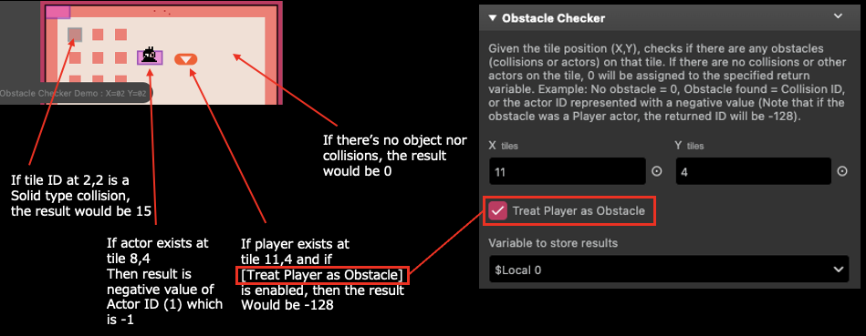

# Obstacle Checker

Obtains an obstacle info at the specified tile position.

:::info
This plugin only supports 8x8 tile size mode.
:::

## Description

Given the tile position (X,Y), checks if there are any obstacles (map collisions or actors) on that tile. If there are no map collisions or other actors on the tile, 0 will be assigned to the specified return variable. Otherwise, this plugin will return the obstacle ID information. Example: No obstacle = 0, Obstacle found = Map Collision ID, or the actor ID represented with a negative value (Note that if the obstacle was a Player actor, the returned ID will be -128). If a map collision ID is found, the actor/player ID will be ignored.

