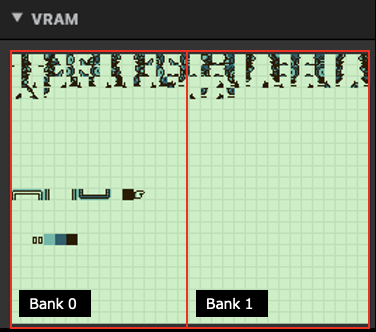
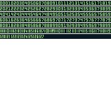

# Sprite Tile Replacer

Replaces a specified sprite tile with ability to select a VRAM bank.

:::info
This plugin is only compatible with Color Only mode.
:::

## Description

Replaces a sprite tile with another tileset tile. Basic functionality is same as the GBVM command: VM_ACTOR_REPLACE_TILE. However, in GB Studio up to version 4.0.x, Color Only mode does not allow you to access extended VRAM bank. This plugin will allow you to specify which VRAM bank to reference.

### _Actor_

The actor in which you want to replace the sprite’s tile.

### _VRAM Bank_

The bank you want to reference. 0 = Bank 0, 1 = Bank 1.

### _Tile Bank_

The source tile bank reference to use for replacing.

### _Tileset_

The source tileset reference to use for replacing.

### _Background Tile Index_

The background tile index in the source tileset to replace with.

### _Sprite Tile Index_

The sprite’s tile index to be replaced by the background tile.

:::tip

### How do I obtain the sprite tile index?

Sprite tiles are scattered elsewhere in somewhat random position inside the VRAM bank(s). First you will need to check which tile index is the one to be replaced. One way of doing this is to create an event like the one below (using this plugin!) and replacing all sprite tiles with a tile image with numberings on it (placeholder tiles).

Then, once you run the scene, you will see the sprite being replaced with these placeholder tiles which makes it more visible which index to be used as the replacement tile. Note that if the [Flip ‘Right’ To Create ‘Left’ Facing Frames] is checked in the Sprite Editor, the placeholder tiles will be flipped as well.

The placeholder tiles can be found as a sample inside this plugin for you to use if needed.

 
:::