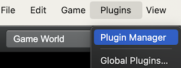
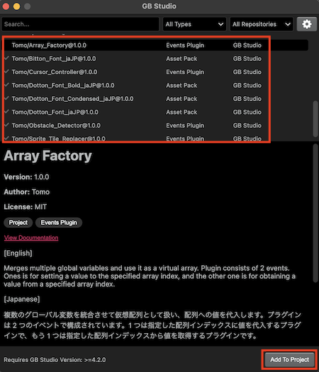
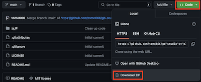
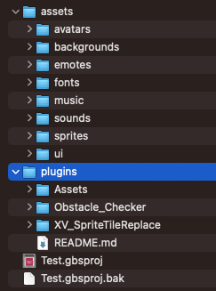
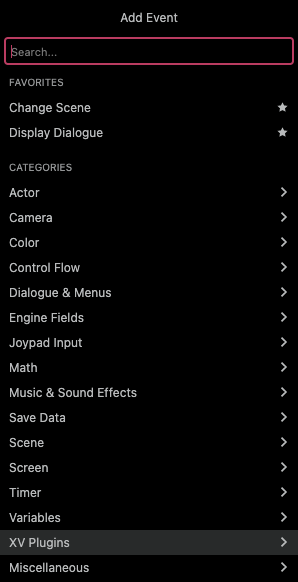
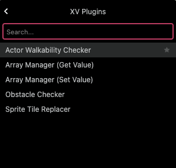

# Installation

## For GB Studio &gt;=4.2.0

From GB Studio 4.2.0, you can now directly install plugins using the new Plugin Manager feature.
With your GB Studio project opened, locate to `Plugins` &gt; `Plugin Manager` from the main toolbar menu.

Then, locate the plugins with names that start with "Tomo" in the GB Studio official repository. Pick the plugins that you want to add to your project and click on `Add To Project` to install.

## For GB Studio 4.X.X

Download the latest plugin from this repository: https://github.com/tomo666/gb-studio-xv-plugins.

Navigate to [Code] > [Download ZIP], and unzip the file to your local folder.

Under “plugins” located inside your GB Studio project folder, copy the plugins that you wish to use. If the plugins folder does not exist, create one.

:::note

The plugins folder should be placed directly in your GB Studio project folder and _not_ in the “assets” folder.

:::

## How to use

Open up your GB Studio project and locate the plugin under [Add Event] > [XV Plugins]. Then, add the event you wish to use.

 

If you installed a font (Assetpack type plugin), you can use it the same way as you use fonts.
