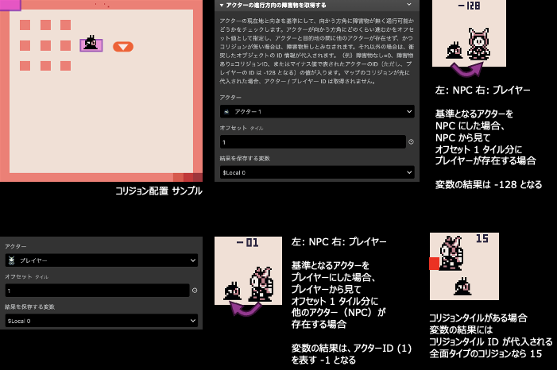

# アクターの進行方向の障害物を取得する

アクターの進行方向の障害物を取得します。

:::info
このプラグインは、8x8 タイルサイズのモードにのみ対応しています。
:::

## 詳細

アクターの現在地と向きを基準にして、向かう方角に障害物が無く通行可能かどうかをチェックします。アクターが向いている方向にアクターがどのくらいのタイル数を進むかをオフセット値として指定し、アクターの現在位置から目的地の間に他のアクターが存在せず、かつコリジョンが無い場合は、障害物無しとみなされます。それ以外の場合は、衝突したオブジェクト（他のアクターまたはコリジョンが適用されたタイル）の ID 情報が代入されます。（例）変数に入る値 --> 障害物なし=0、障害物あり=コリジョン ID、またはマイナス値で表されたアクターの ID（ただし、プレイヤーの ID は -128 となる）の値が入ります。マップのコリジョン ID が先に代入された場合、アクター / プレイヤー ID は取得されません。

