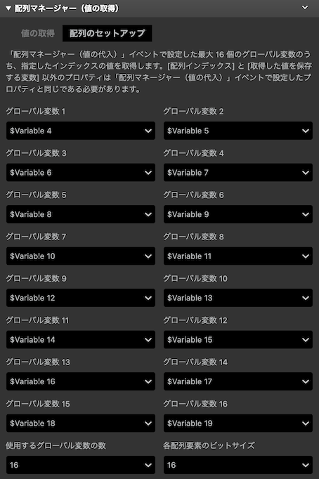
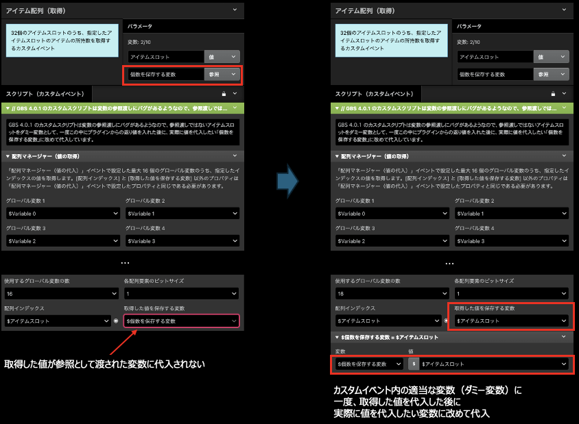

# 配列マネージャー（値の取得）

複数のグローバル変数を統合させて仮想配列として扱い、[配列マネージャー（値の代入）](./array_manager_set.md) プラグインで設定した特定の配列インデックスに格納された値を取得します。

## 詳細

仮想グローバル変数のコンセプトについての詳細は、[配列マネージャー（値の代入）の詳細](./array_manager_set.md#詳細) を参照してください。

### `[配列のセットアップ] タブ`

### _グローバル変数 1 〜 16_

統合したいグローバル変数を指定します。これは、[配列マネージャー（値の代入）](./array_manager_set.md) プラグインで指定したグローバル変数と同じにする必要があります。

### _使用するグローバル変数の数_

上記で設定した変数のうち、冒頭から数えていくつのグローバル変数を統合対象にするかを指定します。基本的には[配列マネージャー（値の代入）](./array_manager_set.md) プラグインで指定したグローバル変数と同じ値にする必要があります。

### _各配列要素のビットサイズ_

1 つのグローバル変数を何ビットで分割するかを指定します。基本的には[配列マネージャー（値の代入）](./array_manager_set.md) プラグインで指定したグローバル変数と同じ値にする必要があります。

### `[値の取得] タブ`

### _配列インデックス_

値を取得したい配列のインデックスを指定します。詳細については、[配列マネージャー（値の代入）](./array_manager_set.md#配列インデックス) の説明をご確認ください。

### _取得した値を保存する変数_

指定した配列インデックスの要素の値を格納する変数を指定します。

:::caution

### （GB Studio v4.0.x）カスタムイベントとして扱う場合の注意点

GBS 4.0.1, 4.0.2 のカスタムスクリプトは変数の参照渡しにバグがあるようなので、値を指定した変数（参照渡しとして）に代入されないことがあります。この場合、回避策として同カスタムイベントのスクリプト内に、参照渡しではないダミー変数を用意して、ダミー変数の中に一度プラグインからの返り値を入れます。その後、実際に値を代入したい参照渡しとして指定した変数にダミー変数から改めて代入します。

:::