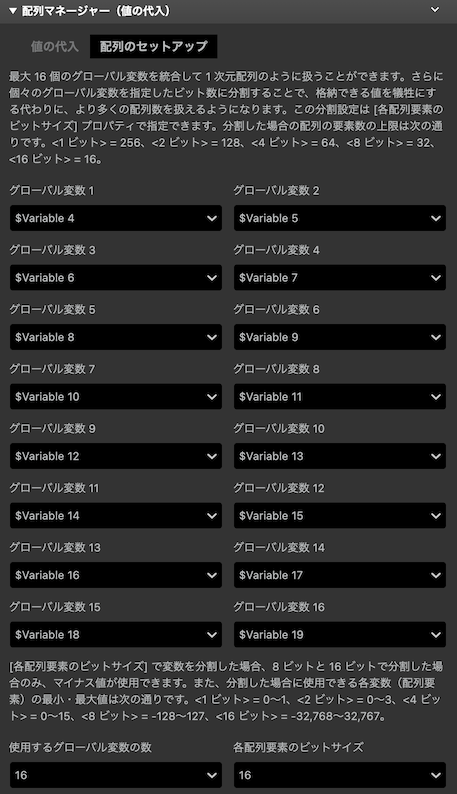
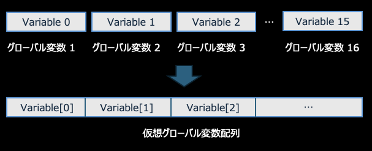
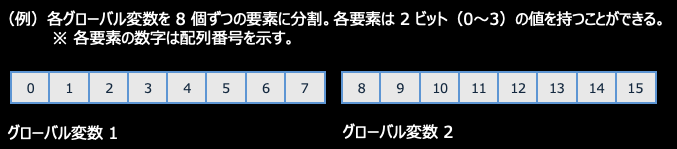

# 配列マネージャー（値の代入）

複数のグローバル変数を統合させて仮想配列として扱い、配列への値を代入します。このプラグインは値を仮想配列に代入することしかできません。値を仮想配列から取得する場合は、[配列マネージャー（値の取得）](./array_manager_get.md) プラグインを使用してください。

## 詳細

最大 16 個のグローバル変数を統合して 1 次元配列のように扱うことができます。さらに個々のグローバル変数を、指定したビット数に分割することで、格納できる値の最大値を犠牲にする代わりに、より多くの配列を扱えるようになります。この分割設定は [各配列要素のビットサイズ] プロパティで指定できます。分割した場合の配列の要素数の上限は次の通りです。&lt;1 ビット&gt; = 256、&lt;2 ビット&gt; = 128、&lt;4 ビット&gt; = 64、&lt;8 ビット&gt; = 32、&lt;16 ビット&gt; = 16。

### `[配列のセットアップ] タブ`

### _グローバル変数 1 〜 16_

統合したいグローバル変数を指定します。 統合したグローバル変数は、ひとつの「仮想グローバル変数」として扱うことができます。仮想グローバル変数にはインデックス（配列番号）が割り当てられるので、例えば統合前のグローバル変数 3 にアクセスしたい場合は、&lt;仮想グローバル変数[2]&gt; のようなイメージでアクセスすることができます（注：配列番号は 0 から始まります）。

### _使用するグローバル変数の数_

上記で設定した変数のうち、冒頭から数えていくつのグローバル変数を統合対象にするかを指定します。上記のスクショの例では、2 と指定した場合、グローバル変数 1 とグローバル変数 2 のみを統合し、他のグローバル変数が指定されていても無視されます。デフォルトの 16 を指定すると、すべてのグローバル変数が統合されます。

### _各配列要素のビットサイズ_

より多くの配列を扱えるように、1 つのグローバル変数を何ビットで分割するかを指定します（GB Studio の各グローバル変数は 16 ビットのビット数を持ちます）。例えば、「2」を指定すると、各グローバル変数が 8 分割されます（例：1 つのグローバル変数は 16 ビットなので、8 個の 2 ビット値を持つ変数に分割することができます）。「8」を指定すると、2 個の要素（各要素は 8 ビットの値を持つ）に分割されます。

[各配列要素のビットサイズ] で変数を分割した場合、8 ビットと 16 ビットで分割した場合のみ、マイナス値が使用できます。また、分割した場合に使用できる各変数（配列要素）の最小・最大値は次の通りです。&lt;1 ビット&gt; = 0〜1、&lt;2 ビット&gt; = 0〜3、&lt;4 ビット&gt; = 0〜15、&lt;8 ビット&gt; = -128〜127、&lt;16 ビット&gt; = -32,768〜32,767。

### `[値の代入] タブ`

### _配列インデックス_

上記で分割されたグローバル変数を 1 つのまとまりとした時に、値を設定したいインデックスを指定します。例えば、16 個のグローバル変数を指定し、それぞれ 1 ビットで分割した場合は、0〜255 の範囲のインデックスを指定することができます。

### _設定値_

指定した配列インデックスの要素に設定する値（整数または変数）を指定します。

#### グローバル変数を 16 個統合した場合の使用可能なサイズ / 値の例

| 各配列要素のビットサイズ | 最大要素数（配列サイズ） | 最小〜最大値 |
|:-----------|:------------:|:------------:|
| 1 | 256 |0〜1|
| 2 | 128 |0〜3|
| 4 | 64 |0〜15|
| 8 | 32 |-128〜127|
| 16 | 16 |-32,768〜32,767|
