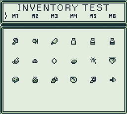
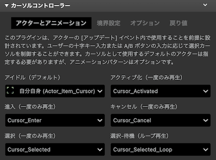
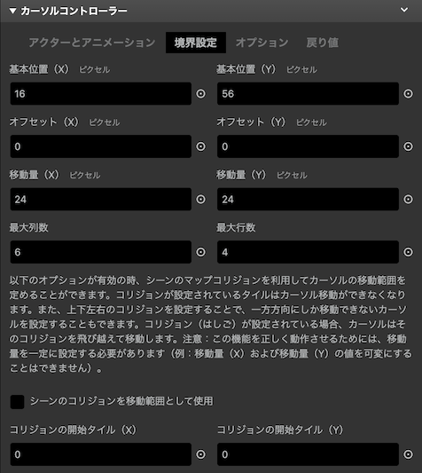
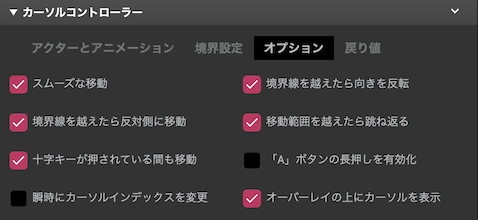
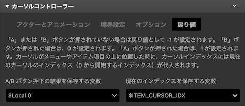

# カーソルコントローラー

簡易的なカーソル操作をスプライトとアニメーションで実現します。

:::info
このプラグインは、8x8 タイルサイズのモードにのみ対応しています。
:::

## 詳細

このプラグインを使用すると、ユーザーの十字キー入力または A/B ボタンの入力に応じて選択カーソルを簡易的に制御することができます。アクターの [アップデート] イベント内で使用することを前提に設計されているため、ユーザー入力とカーソルの位置（インデックス）をリアルタイムで取得することが可能です。

このプラグインを使用する注意点として、汎用性によるゲームパフォーマンスの低下が挙げられます。アニメーションや選択可能なオプションを付加したことで、プラグインのロジックが複雑化しており、他に処理の重いスクリプトが実行されているようなリアルタイム性の高いゲームシステムとの同時併用は相性が悪い可能性があります。

### `[アクターとアニメーション] タブ`

[アクターとアニメーション] タブでは、選択カーソルとして用いるデフォルトのアクターを指定します。移動、決定、キャンセル時など、カーソルの現在の状態に応じて自動的に再生されるスプライトのアニメーションパターンも設定することができます（オプション）。

### _アイドル（デフォルト）_

選択カーソルのアクター。ユーザー入力が無いアイドル状態でループ再生されるデフォルトのアニメーションパターンが設定されます。

### _アクティブ化（一度のみ再生）_

カーソルがアクティブになった時に一度だけ再生されるアニメーションパターンです。

### _進入（一度のみ再生）_

カーソルが十字キー入力によって移動した時に、一度だけ再生されるアニメーションパターンです。

### _キャンセル（一度のみ再生）_

キャンセル時（B ボタン）に、一度だけ再生されるアニメーションパターンです。

### _選択（一度のみ再生）_

項目選択時（A ボタン）に、一度だけ再生されるアニメーションパターンです。

### _選択-待機（ループ再生）_

項目を選択後に繰り返し再生されるアニメーションパターンです。メニュー用とアイテム用といった 2 つ以上の選択カーソルを使用するような UI がある場合に用いることを想定します。メニュー項目が選択された時点で主操作がアイテムカーソルに移るような場合、メニュー用のカーソルが選択中であることを示すために薄い色にしたり、点滅させたりなど、メニューカーソルが選択済みである状態を表現することができます。

### `[境界設定] タブ`

[境界設定] タブでは、カーソルの移動可能範囲および移動ステップごとの移動量の設定を行います。

### _基本位置（X）_

最左側のカーソルの基本位置（X 軸）をピクセル単位で指定します。

### _基本位置（Y）_

最上側のカーソルの基本位置（Y 軸）をピクセル単位で指定します。

### _オフセット（X）_

必要に応じて X 軸のオフセットをピクセル単位で指定します。基本的にこの値は 0 のままにしておきます。オフセットを変更するようなケースは、例えばカーソルの位置（移動ステップ量）が項目によって異なるなど、移動量を動的に変更したい場合などです。

### _オフセット（Y）_

必要に応じて Y 軸のオフセットをピクセル単位で指定します。基本的にこの値は 0 のままにしておきます。オフセットを変更するようなケースは、例えばカーソルの位置（移動ステップ量）が項目によって異なるなど、移動量を動的に変更したい場合などです。

### _移動量（X）_

十字キー（X 軸方向）が入力された時に、カーソルが水平方向に移動するピクセル数を指定します。

### _移動量（Y）_

十字キー（Y 軸方向）が入力された時に、カーソルが垂直方向に移動するピクセル数を指定します。

### _最大列数_

カーソルが水平方向に移動できる最大ステップ数（列）を指定します。

### _最大行数_

カーソルが垂直方向に移動できる最大ステップ数（行）を指定します。

### _シーンのコリジョンを移動範囲として使用_

このオプションが有効の時、シーンのマップコリジョンを利用してカーソルの移動範囲を定めることができます。コリジョンが設定されているタイルはカーソル移動ができなくなります。また、上下左右のコリジョンを設定することで、一方方向にしか移動できないカーソルを設定することもできます。コリジョン（はしご）が設定されている場合、カーソルはそのコリジョンを飛び越えて移動します。注意：この機能を正しく動作させるためには、移動量を一定に設定する必要があります（例：移動量（X）および移動量（Y）の値を可変にすることはできません）。

例えば、上記のスクリーンショットのでは、画面の右下にゴミ箱（に見えるかどうかは別として）がありますが、その左側にはアイテムの無い空のエリアがあります。カーソルをアイテムのある項目とゴミ箱だけに移動できるようにしたいとします。このような場合は、アイテムとゴミ箱以外にコリジョンが設定されるように、移動範囲のコリジョンを配置します。なお、コリジョンはどこに配置しても構いませんが、最大列数と最大行数と同じ範囲で設置する必要があります。

### _コリジョンの開始タイル（X）_

移動範囲として設定するコリジョンの開始地点（X）をタイル座標の単位で指定します。

### _コリジョンの開始タイル（Y）_

移動範囲として設定するコリジョンの開始地点（Y）をタイル座標単位で指定します。

### `[オプション] タブ`

[オプション] タブでは選択カーソルの表示や動作の挙動を設定することができます。

import smooth_movement_off from './docs-extras/img/cursor_controller/smooth_movement_off_480p.gif';
import smooth_movement_on from './docs-extras/img/cursor_controller/smooth_movement_on_480p.gif';
import reverse_dir_on_end_reached_480p from './docs-extras/img/cursor_controller/reverse_dir_on_end_reached_480p.gif';
import move_to_opposite_480p from './docs-extras/img/cursor_controller/move_to_opposite_480p.gif';
import cursor_option_bounce_480p from './docs-extras/img/cursor_controller/cursor_option_bounce_480p.gif';

### _スムーズな移動_

このオプションを有効にすると、カーソルが滑らかなアニメーションで移動します。

*無効*

*有効*

### _境界線を越えたら向きを反転_

[スムーズな移動] および [境界線を越えたら反対側に移動] が有効の場合、カーソルが進行方向と逆方向にアニメーションしながら戻ります。

### _境界線を越えたら反対側に移動_

カーソルが列または行の境界線を越えたら、その列または行の反対側に移動します。

### _移動範囲を越えたら跳ね返る_

このオプションを有効にすると、カーソルが移動可能な範囲を越えようとした場合、または [シーンのコリジョンを移動範囲として使用] オプションが有効の状態でコリジョン衝突した場合に、少量の振動を与え、跳ね返るようなエフェクトアニメーションを再生します。

### _十字キーが押されている間も移動_

十字キーが押されている間もカーソル移動を行います。

### _「A」ボタンの長押しを有効化_

「A」ボタンを押し続けている間は、常に「A」ボタンをトリガーします。

### _瞬時にカーソルインデックスを変更_

有効化した場合は、カーソルが現在の位置から移動した瞬間にカーソルのインデックスを変更します。無効化した場合は、カーソルが新しい位置への移動を完了してからインデックスが変更されます。インデックスの変更のタイミングに応じて特定のスクリプトを実行したいケースなどで活用できます。

### _オーバーレイの上にカーソルを表示_

オーバーレイの上にカーソルを表示します。※ 現行の GB Studio エンジンの仕様上の問題で、ダイアログやメニューダイアログではこの機能が正しく有効化されない可能性があります。

### `[戻り値] タブ`

カーソルの現在のインデックスや、ボタン押下の識別番号を保存する変数を指定できます。

カーソルインデックスは、下記のように左から右に順番に番号が割り当てられます。インデックスは、境界設定で指定した最大列数および最大行数に基づいて自動的に割り振られます。

### _A/B ボタン押下の結果を保存する変数_

「A」または「B」ボタンが押された時に、その結果を保存する変数を指定します。「A」または「B」ボタンが押されていない場合は戻り値として -1 が設定されます。「B」ボタンが押された場合は、0 が設定されます。「A」ボタンが押された場合は、1 が設定されます。

### _現在のインデックスを保存する変数_

現在のカーソルインデックスを保存するための変数です。カーソルがメニューやアイテム項目の上に位置した時に、カーソルインデックスには現在のカーソルのインデックス（0 から開始するインデックス）が代入されます。
