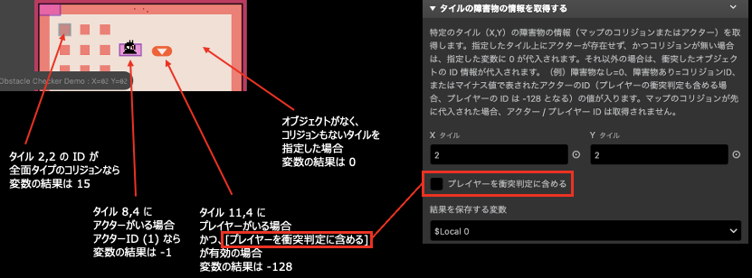

# タイルの障害物の情報を取得する

特定のタイルの障害物の情報を取得します。

:::info
このプラグインは、8x8 タイルサイズのモードにのみ対応しています。
:::

## 詳細

特定のタイル（X,Y）の障害物の情報（マップのコリジョンまたはアクター）を取得します。指定したタイル上にアクターが存在せず、かつコリジョンが無い場合は、指定した変数に 0 が代入されます。それ以外の場合は、コリジョン オブジェクトの ID 情報が代入されます。（例）変数に入る値 --> 障害物なし=0、障害物あり=コリジョン ID、またはマイナス値で表されたアクターの ID（プレイヤーの衝突判定も含める場合、プレイヤーの ID は -128 となる）の値が入ります。マップのコリジョン ID が先に代入された場合、アクター / プレイヤー ID は取得されません。

