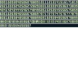

# 指定のスプライトタイルを置き換える

指定のスプライトタイルを置き換えます（VRAM バンク切り替え可能）。

:::info
このプラグインは「カラーのみ」モードでのみ使用可能です。
:::

## 詳細

スプライトのタイルを指定のタイルで置き換えます。GBVM 命令の VM_ACTOR_REPLACE_TILE と機能的にはほぼ同じですが、v4.0.x の時点では「カラーのみ」モード指定の際に拡張された VRAM バンクにアクセスできないため、VRAM バンクを指定できるようにして、GBVM 命令を書かなくてもイベントとして使えるようにしたプラグインです。

### _アクター_

スプライトを保持するアクターを指定します。

### _VRAM バンク_

置き換え対象となるタイルがどのバンクにあるかに応じて 0 または 1 を指定します。

### _タイルバンク_

置き換え元のタイルバンクを指定します。

### _タイルセット_

置き換え元のタイルセットを指定します。

### _背景タイルのインデックス_

置き換え元のタイルセットのインデックス（左上から 0 で始まります）を指定します。

### _スプライトタイルのインデックス_

置き換え先のスプライトタイルのインデックス（取得方法は後述）を指定します。

:::tip

### スプライトタイルのインデックスを取得するには？

スプライトのタイルは VRAM バンク内の予測できない場所に散りばめられるようです。そのため、まずは置き換え対象となるタイルのインデックスを取得する必要があります。以下のようなイベントを作成して、同プラグインを用いて VRAM（バンク 0 および 1）を数字付きのタイルセット（プレースホルダ タイル）で埋めます。

すると、ゲーム実行時にタイル インデックスがあてられたスプライトが表示されるので、置き換え目的のインデックスを取得しやすくなります。 なお、GB Studio のスプライト画面で `[「右」反転して「左」向きフレームを自動生成]` チェックボックスが有効になっている場合は、タイルセットも反転してしまいますので、ご注意ください。

数字タイルセット画像は、プラグインフォルダに同梱されている「Number_Tiles_vram0.png」および「Number_Tiles_vram1.png」をサンプルとしてお使いいただけます。

 
:::