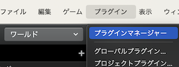
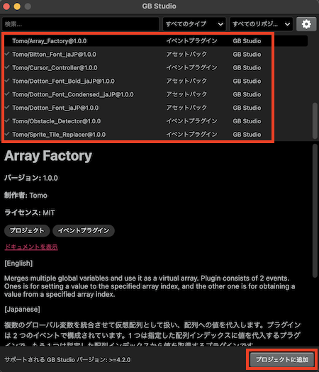
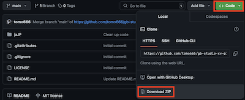
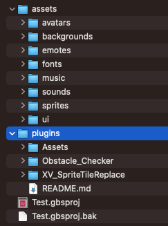
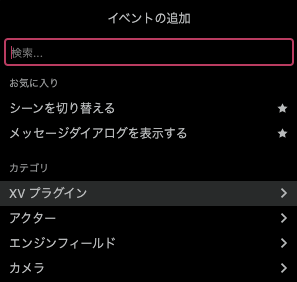
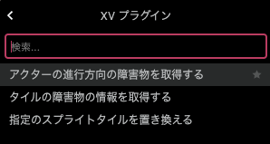

# インストール

## GB Studio &gt;=4.2.0 の場合

GB Studio 4.2.0 より、プラグインを管理する新しい機能である「プラグインマネージャー」が追加されました。この機能を用いることで簡単にプラグインのインストールと管理が可能になります。GB Studio プロジェクトを開いている状態で、メインメニューの `プラグイン` &gt; `プラグインマネージャー` からアクセスできます。

プラグインマネージャーのダイアログが開いたら、GB Studio 公式リポジトリ内にある「Tomo」から始まるプラグイン名を選択し、`プロジェクトに追加` をクリックしてインストールしてください。

## GB Studio 4.X.X の場合

GitHub リポジトリから最新版のプラグインをダウンロードします：https://github.com/tomo666/gb-studio-xv-plugins

上記ページの [Code] > [Download ZIP] からプラグインをダウンロード・解凍します。

GB Studio プロジェクトフォルダの「plugins」フォルダに使用したいプラグインのフォルダをコピーしてください（plugins フォルダが存在しない場合は手動で作成してください）。

:::note

assets フォルダの中ではなく、プロジェクトフォルダ直下であることに注意してください。

:::

## 使い方

GB Studio のプロジェクトを開き、[イベントの追加] ダイアログの [XV プラグイン] カテゴリ サブメニューから使用するイベントを追加します。

 

フォントのアセットプラグインをインストールした場合は、通常のフォントと同じように使用することができます。